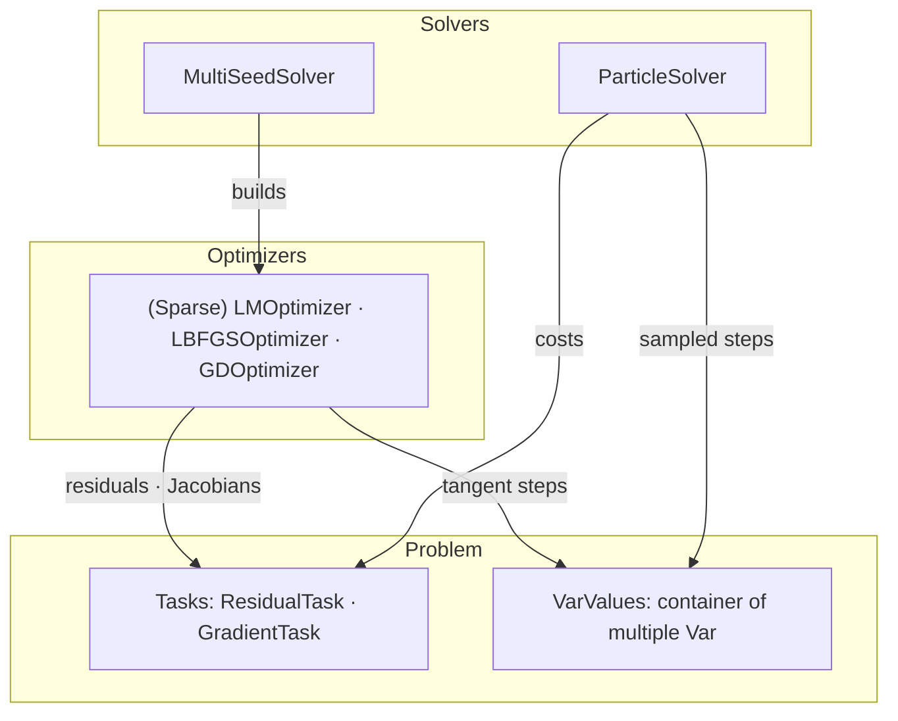
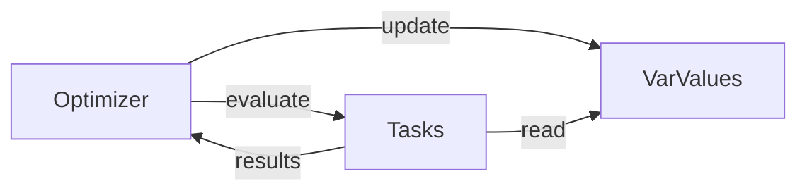

# Optimization

`robokit.opt` solves batched nonlinear optimization problems on the GPU. Variables live on
manifolds, costs come from `robokit.terms` (least-squares residuals or general cost
gradients). IK, motion planning, retargeting, hand-eye calibration, grasp synthesis build
on it.

## Overview

Two levels: a **solver** manages a population of candidates per problem and builds one
optimizer (or sampler) per stage; an **optimizer** iterates gradient steps on one candidate
per problem.



```python
state = robot.state(q=q_init)  # a Var leaf
task = FrameTask(robot, frame_index=ee, T_world_target=target)  # a Task

optimizer = LBFGSOptimizer(terms=[task])
values, costs = optimizer.solve(VarValues(robot=state))  # one final cost per returned instance
state = values.get("robot")

values = VarValues(robot=state, ee=ee_traj)  # co-optimize multiple Vars
values, costs = LBFGSOptimizer(terms=[task, ee_task]).solve(values)

solver = MultiSeedSolver(terms=[[task]], config=cfg)
best_values, best_costs = solver.solve(seed_values)  # B × num_seeds candidates in
```

## Variables

`Var` is an optimizable value on a manifold, such as joint angles or an SE(3) pose.
`VarValues` maps names to `Var` instances and presents them to optimizers and tasks as one
combined variable.



Common methods:

- `integrate(delta, out=None)`: Integrate a tangent step `delta` into the variable. Each `Var` defines its tangent integration: joint angles use addition, while poses use the exponential map with right multiplication, `T·exp(δ)`.
- `accept(mask, proposed)` accepts proposed batch rows and preserves rejected rows.
- `invalidate()` marks underlying `Var` instances as changed, invalidating their caches.

Note: `VarValues` lays out tangent columns contiguously in insertion order. For example:

```
tangent columns: [   robot (T=7)   |   ee (T=6)   ]
                     offset=0          offset=7
```

## Tasks

Tasks come from `robokit.terms`. Two sibling interfaces under a shared `Task` base class:

| Term           | Contract                           | Consumed by                 |
| -------------- | ---------------------------------- | --------------------------- |
| `ResidualTask` | residual vector `r` (+ Jacobian)   | LM; GD/LBFGS residual modes |
| `GradientTask` | per-batch scalar cost (+ gradient) | GD/LBFGS                    |

Variants: `SparseTask` extends `ResidualTask` with a sparse Jacobian. `EagerTask` extends
`ResidualTask` with hooks for work outside captured CUDA graphs.

Task interfaces can be mixed. For example, `SmoothnessTask(ResidualTask, GradientTask)`
supports both residual and direct-gradient evaluation.

## Optimizers

Optimizers come from `robokit.opt`. Three families share the same `solve(VarValues)`
interface:

| Optimizer        | Method                                                |
| ---------------- | ----------------------------------------------------- |
| `LMOptimizer`    | Damped Gauss–Newton; sparse LM for large trajectories |
| `LBFGSOptimizer` | Limited-memory quasi-Newton with line search          |
| `GDOptimizer`    | GD, Adam, or AdamW                                    |

One optimization step:

1. Updated `VarValues` invalidate their derived caches.
2. The optimizer calls each task's `precompute()` serially.
3. Tasks compute costs and optional derivatives in parallel when enabled.
4. The optimizer updates the values or accepts or rejects a proposal.

## Solvers

Solvers come from `robokit.opt`. Two families refine populations of `VarValues` across
stages:

| Solver            | Method                                                              |
| ----------------- | ------------------------------------------------------------------- |
| `MultiSeedSolver` | Runs an optimizer from multiple seeds and keeps the best candidates |
| `ParticleSolver`  | Runs MPPI sampling and supports reactive MPC                        |

At each stage, a solver updates all candidates, scores them, and keeps the best `k` per
problem. The final stage returns the best candidate.
