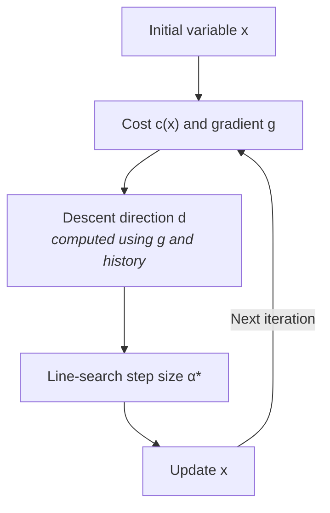

# LBFGSOptimizer

Implements batched [L-BFGS](https://en.wikipedia.org/wiki/Limited-memory_BFGS)
on manifold-valued variables. Source: `src/robokit/opt/lbfgs_optimizer.py`.

## Overview

Starting from initial variable $\mathbf{x}$, L-BFGS computes its cost
$c(\mathbf{x})$ and gradient $\mathbf{g}=\nabla c(\mathbf{x})$. At each
iteration, it uses $\mathbf{g}$ and the history to compute a descent direction
$\mathbf{d}$. With no history, $\mathbf{d}$ follows $-\mathbf{g}$; the retained history
then adjusts that direction using observed curvature. The line search chooses
a step size $\alpha^*$, and the optimizer updates $\mathbf{x}$ by
$\alpha^*\mathbf{d}$.

## Descent direction

L-BFGS computes the descent direction $\mathbf{d}$ from the current gradient
$\mathbf{g}$ and a limited history of previous steps. At optimizer iteration
$t$, the update from $\mathbf{x}_t$ to $\mathbf{x}_{t+1}$ produces one history
pair:

- $\mathbf{s}_t = \alpha_t^* \mathbf{d}_t$: the tangent-space update applied to
  $\mathbf{x}_t$.
- $\mathbf{y}_t = \mathbf{g}_{t+1} - \mathbf{g}_t$: the gradient change caused
  by $\mathbf{s}_t$.
  In local coordinates, the first-order Taylor expansion of the gradient is

  $$
  \mathbf{g}(\mathbf{x}_t+\mathbf{s}_t)
  \approx \mathbf{g}(\mathbf{x}_t)+J_{\mathbf{g}}(\mathbf{x}_t)\mathbf{s}_t.
  $$

  Here, the gradient Jacobian is the cost Hessian,
  $J_{\mathbf{g}}(\mathbf{x})=H(\mathbf{x})=\nabla^2 c(\mathbf{x})$, so
  $\mathbf{y}_t\approx H(\mathbf{x}_t)\mathbf{s}_t$.

[Newton's method](https://en.wikipedia.org/wiki/Newton%27s_method_in_optimization)
uses $\mathbf{d}=-H(\mathbf{x})^{-1}\mathbf{g}$. L-BFGS
replaces the exact inverse with an approximation $A$:

$$
A\approx H(\mathbf{x})^{-1},
\qquad
\mathbf{d}=-A\mathbf{g}.
$$

For the update below, $i$ indexes retained history pairs from oldest to newest.
Let $A_i$ be the approximation after incorporating $i$ pairs, with
$A_0=\gamma I$. BFGS incorporates pair $i$ using

$$
A_{i+1}=V_iA_iV_i^\top+\rho_i \mathbf{s}_i \mathbf{s}_i^\top,
\qquad
V_i=I-\rho_i \mathbf{s}_i \mathbf{y}_i^\top,
\qquad
\rho_i=\frac{1}{\mathbf{y}_i^\top \mathbf{s}_i}.
$$

The optimizer uses this update only when
$\mathbf{y}_i^\top\mathbf{s}_i>0$; otherwise, it discards the pair. For an
accepted pair, the update enforces $A_{i+1}\mathbf{y}_i=\mathbf{s}_i$ while
keeping $A_{i+1}$ symmetric and positive definite.

Why does the update work?

1. Why does it enforce $A_{i+1}\mathbf{y}_i=\mathbf{s}_i$?

Because $\rho_i(\mathbf{y}_i^\top \mathbf{s}_i)=1$,
$V_i^\top \mathbf{y}_i=\mathbf{y}_i-\rho_i\mathbf{y}_i
(\mathbf{y}_i^\top \mathbf{s}_i)=\mathbf{0}$. Substituting this into the update
gives

$$
A_{i+1}\mathbf{y}_i
=V_iA_iV_i^\top \mathbf{y}_i
+\rho_i\mathbf{s}_i(\mathbf{y}_i^\top \mathbf{s}_i)
=\mathbf{0}+\rho_i\mathbf{s}_i(\mathbf{y}_i^\top \mathbf{s}_i)
=\mathbf{s}_i.
$$

2. Why it stays symmetric and positive definite?

When $A_i$ is symmetric positive definite, both $V_iA_iV_i^\top$ and
$\rho_i\mathbf{s}_i\mathbf{s}_i^\top$ are symmetric. If
$\mathbf{y}_i^\top\mathbf{s}_i>0$, then $\rho_i>0$, and for any nonzero
$\mathbf{z}$,

$$
\mathbf{z}^\top A_{i+1}\mathbf{z}
=(V_i^\top \mathbf{z})^\top A_i(V_i^\top \mathbf{z})
+\rho_i(\mathbf{s}_i^\top \mathbf{z})^2>0.
$$

Thus, $A_{i+1}$ remains symmetric positive definite.

After incorporating all retained pairs, the resulting $A$ approximates
$H(\mathbf{x})^{-1}$ and gives the descent direction
$\mathbf{d}=-A\mathbf{g}$. Since only $A\mathbf{g}$ is needed, L-BFGS avoids
constructing the $n\times n$ matrix $A$ and instead uses the two-loop recursion
over $m$ history pairs. This requires $O(mn)$ memory and $O(mn)$ operations,
where $m\ll n$.

**Normalization.** Our implementation rescales the direction to unit length by
default, keeping only where to move and discarding how far the curvature
suggests.

How does the matrix update become two loops?

The direction requires $A_m\mathbf{g}$, where $m$ is the number of retained
history pairs. Repeatedly expanding $A_m\mathbf{g}$ using the BFGS update rule
gives

$$
\begin{aligned}
A_m\mathbf{g}
&=V_{m-1}A_{m-1}(V_{m-1}^\top\mathbf{g})
+\rho_{m-1}\mathbf{s}_{m-1}
(\mathbf{s}_{m-1}^\top\mathbf{g}) \\
&=V_{m-1}\Big[
V_{m-2}A_{m-2}(V_{m-2}^\top V_{m-1}^\top\mathbf{g})
+\rho_{m-2}\mathbf{s}_{m-2}
(\mathbf{s}_{m-2}^\top V_{m-1}^\top\mathbf{g})
\Big] \\
&\quad+\rho_{m-1}\mathbf{s}_{m-1}
(\mathbf{s}_{m-1}^\top\mathbf{g}) \\
&=\cdots \\
&=V_{m-1}\cdots V_0A_0
(V_0^\top\cdots V_{m-1}^\top\mathbf{g}) \\
&\quad+\cdots+\rho_{m-1}\mathbf{s}_{m-1}
(\mathbf{s}_{m-1}^\top\mathbf{g}).
\end{aligned}
$$

First, we want to compute this vector product
$V_0^\top\cdots V_{m-1}^\top\mathbf{g}$. For simplicity, define
$\mathbf{q}_0=V_0^\top\cdots V_{m-1}^\top\mathbf{g}$.

Compute this product using the update rule from $\mathbf{q}_{i+1}$ to
$\mathbf{q}_i$:

$$
\mathbf{q}_i
=V_i^\top\mathbf{q}_{i+1}
=\mathbf{q}_{i+1}
-\rho_i\mathbf{y}_i(\mathbf{s}_i^\top\mathbf{q}_{i+1}).
$$

Starting from $\mathbf{q}_m=\mathbf{g}$, the first loop applies this rule
backward from $i=m-1$ to $i=0$, producing $\mathbf{q}_0$.

Second, we want to evaluate the remaining parts, starting from
$A_0\mathbf{q}_0$. For simplicity, define
$\mathbf{r}_0=A_0\mathbf{q}_0=\gamma\mathbf{q}_0$.

Compute the remaining terms using the update rule from $\mathbf{r}_i$ to
$\mathbf{r}_{i+1}$:

$$
\mathbf{r}_{i+1}
=V_i\mathbf{r}_i
+\rho_i\mathbf{s}_i(\mathbf{s}_i^\top\mathbf{q}_{i+1})
=\mathbf{r}_i+\rho_i\mathbf{s}_i
(\mathbf{s}_i^\top\mathbf{q}_{i+1}-\mathbf{y}_i^\top\mathbf{r}_i).
$$

Starting from $\mathbf{r}_0$, the second loop applies this rule forward from
$i=0$ to $i=m-1$, producing $\mathbf{r}_m=A_m\mathbf{g}$.

The corresponding pseudocode:

$$
\begin{array}{l}
\textbf{input}: \mathbf{g},\ \text{history},\ \gamma \\
\textbf{initialize}: \mathbf{q}_m\leftarrow\mathbf{g} \\
\textbf{for }i=m-1,\ldots,0 \\
\hspace{5mm} \mathbf{q}_i\leftarrow\mathbf{q}_{i+1}
-\rho_i\mathbf{y}_i(\mathbf{s}_i^\top\mathbf{q}_{i+1}) \\
\mathbf{r}_0\leftarrow\gamma\mathbf{q}_0 \\
\textbf{for }i=0,\ldots,m-1 \\
\hspace{5mm} \mathbf{r}_{i+1}\leftarrow\mathbf{r}_i
+\rho_i\mathbf{s}_i
(\mathbf{s}_i^\top\mathbf{q}_{i+1}-\mathbf{y}_i^\top\mathbf{r}_i) \\
\textbf{return}: \mathbf{d}\leftarrow-\mathbf{r}_m
\end{array}
$$

**Initial scale.** The starting approximation is $A_0=\gamma I$, where
$\gamma$ can be fixed. A common adaptive choice,
[Barzilai-Borwein scaling](https://en.wikipedia.org/wiki/Barzilai%E2%80%93Borwein_method),
uses the newest history pair $(\mathbf{s}_{m-1},\mathbf{y}_{m-1})$ and chooses
$\gamma$ so $\gamma\mathbf{y}_{m-1}$ best approximates $\mathbf{s}_{m-1}$:

$$
\gamma
=\frac{\mathbf{s}_{m-1}^\top\mathbf{y}_{m-1}}
{\mathbf{y}_{m-1}^\top\mathbf{y}_{m-1}}.
$$

## Line search

The optimizer evaluates a predefined set of candidate step sizes $\alpha_j$
together and selects

$$
\alpha^*
=
\begin{cases}
\displaystyle
\max_j\left\{
\alpha_j
\;\middle|\;
c(\mathbf{x}\oplus\alpha_j\mathbf{d})
\le c(\mathbf{x})+c_1\alpha_j\mathbf{g}^\top\mathbf{d}
\right\},
& \text{if any candidate passes},
\\[3mm]
0,
& \text{otherwise}.
\end{cases}
$$

Since $A$ is positive definite, $\mathbf{g}^\top A\mathbf{g}>0, \mathbf{g}^\top\mathbf{d}<0$. The
[Armijo condition](https://en.wikipedia.org/wiki/Wolfe_conditions)
$c(\mathbf{x}\oplus\alpha_j\mathbf{d})\le
c(\mathbf{x})+c_1\alpha_j\mathbf{g}^\top\mathbf{d}$ therefore requires the
actual decrease to be at least $c_1$ of the predicted first-order decrease. The
Armijo parameter $c_1$ defaults to $10^{-4}$; a larger value requires more
decrease.
