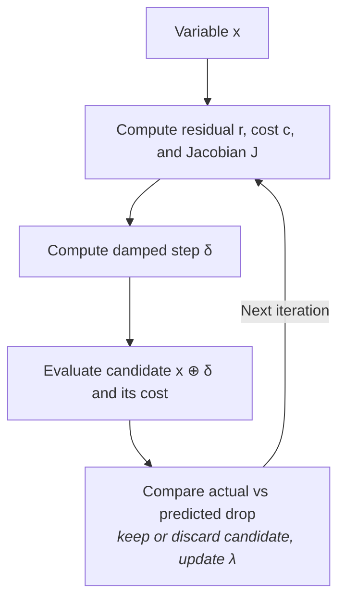

# LMOptimizer

Implements batched
[Levenberg-Marquardt](https://en.wikipedia.org/wiki/Levenberg%E2%80%93Marquardt_algorithm)
on manifold-valued variables. Source:
`src/robokit/opt/lm_optimizer.py`, `src/robokit/opt/sparse_lm_optimizer.py`.

## Overview

Starting from the current variable
$\mathbf{x}$, LM computes the residual vector $\mathbf{r}(\mathbf{x})$, the cost
$c(\mathbf{x})=\frac12\|\mathbf{r}(\mathbf{x})\|^2$, and the residual Jacobian
$J$. From these it computes a damped step $\boldsymbol{\delta}$ and applies it
to obtain a candidate $\widehat{\mathbf{x}}=\mathbf{x}\oplus\boldsymbol{\delta}$.
Since the step comes from an approximation of the cost near $\mathbf{x}$, the
candidate is not trusted directly: LM compares how much the cost actually
dropped with how much the approximation said it would drop. That comparison
decides whether $\widehat{\mathbf{x}}$ replaces $\mathbf{x}$ and whether the
damping $\lambda$ grows or shrinks.

## LM step

**[Gauss-Newton](https://en.wikipedia.org/wiki/Gauss%E2%80%93Newton_algorithm).**
For the nonlinear least-squares cost
$c(\mathbf{x})=\frac12\|\mathbf{r}(\mathbf{x})\|^2$, the first-order Taylor
approximation under a tangent-space step $\boldsymbol{\delta}$ is
$\mathbf{r}(\mathbf{x}\oplus\boldsymbol{\delta})\approx
\mathbf{r}(\mathbf{x})+J\boldsymbol{\delta}$.

This gives the Gauss-Newton subproblem $\min_{\boldsymbol{\delta}}\;
\frac12\|\mathbf{r}(\mathbf{x})+J\boldsymbol{\delta}\|^2$, with gradient
$J^\top(\mathbf{r}(\mathbf{x})+J\boldsymbol{\delta})$. Setting the gradient to zero yields
the normal equations

$$
J^\top J\boldsymbol{\delta}=-J^\top\mathbf{r}(\mathbf{x}).
$$

Gauss-Newton computes $\boldsymbol{\delta}$ by solving this linear system,
producing the candidate $\widehat{\mathbf{x}}=
\mathbf{x}\oplus\boldsymbol{\delta}$. (This can also be understood as a
[Newton-like step](https://en.wikipedia.org/wiki/Newton%27s_method_in_optimization):
$J^\top\mathbf{r}(\mathbf{x})=\nabla c(\mathbf{x})$, while
$J^\top J\approx H(\mathbf{x})=\nabla^2c(\mathbf{x})$.)

**Levenberg-Marquardt.** LM adds a penalty for large steps:

$$
\min_{\boldsymbol{\delta}}\quad
\frac12\left\|\mathbf{r}(\mathbf{x})+J\boldsymbol{\delta}\right\|^2
+\frac{\lambda}{2}\left\|\boldsymbol{\delta}\right\|^2.
$$

This gives

$$
\left(J^\top J+\lambda I\right)\boldsymbol{\delta}
=-J^\top\mathbf{r}(\mathbf{x}).
$$

A larger $\lambda$ therefore produces a more cautious step. Dense LM solves
this system with batched Cholesky; sparse LM uses conjugate gradient, stopping
once the residual falls below a tolerance or an iteration cap derived from the
tangent dimension is reached.

## [Trust region](https://en.wikipedia.org/wiki/Trust_region)

LM evaluates the candidate $\widehat{\mathbf{x}}$. The actual reduction is
$c(\mathbf{x})-c(\widehat{\mathbf{x}})$. The reduction predicted by the local
Gauss-Newton model is

$$
\begin{aligned}
\Delta c_{\mathrm{pred}}
&=\frac12\|\mathbf{r}(\mathbf{x})\|^2
-\frac12\|\mathbf{r}(\mathbf{x})+J\boldsymbol{\delta}\|^2 \\
&=-\mathbf{r}(\mathbf{x})^\top J\boldsymbol{\delta}
-\frac12(J\boldsymbol{\delta})^\top(J\boldsymbol{\delta}).
\end{aligned}
$$

For $\Delta c_{\mathrm{pred}}>0$, the gain ratio compares the actual and predicted
reductions:

$$
\rho=\frac{c(\mathbf{x})-c(\widehat{\mathbf{x}})}
{\Delta c_{\mathrm{pred}}+\epsilon}.
$$

Here, $\epsilon\ge0$ is a small numerical stabilizer, with default $10^{-8}$;
$0$ uses the exact ratio. A $\rho$ near $1$ means the local model predicted the
cost reduction accurately. LM accepts the candidate exactly when

$$
\boxed{\text{accept}\iff
\Delta c_{\mathrm{pred}}>0\ \land\ \rho\ge\rho_{\min}}.
$$

The default is $\rho_{\min}=10^{-3}$. With damping update factor $\nu>1$,
acceptance keeps $\widehat{\mathbf{x}}$ and sets
$\lambda\leftarrow\lambda/\nu$ (less damping, larger next step); rejection keeps
$\mathbf{x}$ and sets $\lambda\leftarrow\lambda\nu$ (more damping, smaller next
step).

## Algorithm

$$
\begin{array}{l}
\textbf{input}: \mathbf{x}_0,\quad
\lambda_0,\quad
\nu>1 \text{ (damping update factor)},\quad
\rho_{\min} \text{ (acceptance threshold)}, \\
\hspace{13mm}
\epsilon \text{ (numerical stabilizer)},\quad
[\lambda_{\min},\lambda_{\max}],\quad
T \text{ (iterations)} \\[1mm]
\textbf{initialize}: \mathbf{x}\leftarrow\mathbf{x}_0,\ \lambda\leftarrow\lambda_0 \\[1mm]
\textbf{for}\ t=1,\dots,T\ \textbf{do} \\
\hspace{5mm} \mathbf{r}\leftarrow\mathbf{r}(\mathbf{x}),\quad
J\leftarrow J(\mathbf{x}),\quad
c\leftarrow\tfrac12\|\mathbf{r}\|^2 \\
\hspace{5mm} \text{solve } (J^\top J+\lambda I)\boldsymbol{\delta}=-J^\top\mathbf{r}
\quad \text{for } \boldsymbol{\delta} \\
\hspace{5mm} \widehat{\mathbf{x}}\leftarrow\mathbf{x}\oplus\boldsymbol{\delta},
\quad
\text{evaluate }c(\widehat{\mathbf{x}})=\tfrac12\|\mathbf{r}(\widehat{\mathbf{x}})\|^2 \\
\hspace{5mm} \Delta c_{\mathrm{pred}}\leftarrow
\tfrac12\|\mathbf{r}\|^2-\tfrac12\|\mathbf{r}+J\boldsymbol{\delta}\|^2 \\
\hspace{5mm} \textbf{if}\ \Delta c_{\mathrm{pred}}>0\quad\textbf{and}\quad
\dfrac{c-c(\widehat{\mathbf{x}})}{\Delta c_{\mathrm{pred}}+\epsilon}\ge\rho_{\min} \\
\hspace{10mm} \mathbf{x}\leftarrow\widehat{\mathbf{x}},\quad
\lambda\leftarrow\lambda/\nu \\
\hspace{5mm} \textbf{else} \\
\hspace{10mm} \lambda\leftarrow\lambda\nu
\quad \text{($\mathbf{x}$ stays unchanged)} \\
\hspace{5mm} \lambda\leftarrow
\operatorname{clip}(\lambda,\lambda_{\min},\lambda_{\max}) \\
\textbf{return}\ \mathbf{x}
\end{array}
$$
