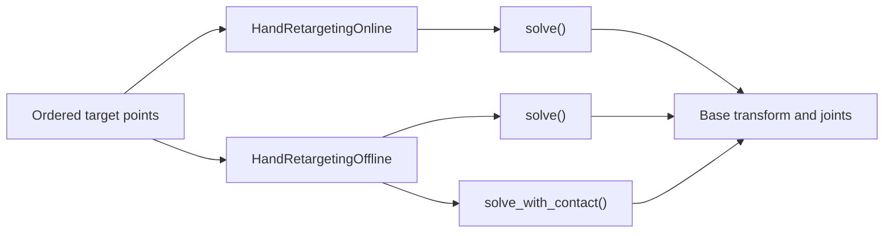

# Hand Retargeting

`robokit.helpers.hand_retargeting` maps ordered hand points to robot states. Online retargeting solves one frame at a time; offline retargeting jointly solves a trajectory. Complete programs are in [`examples/hand_retarget`](../../examples/hand_retarget/).

## How Retargeting Works



## Presets

Each robot preset is a module with a shared hand specification and separate workflow configurations.

```python
from robokit.helpers.hand_retargeting.presets import shadow

spec = shadow.spec
online_config = shadow.online
offline_config = shadow.offline
```

The point axis follows `spec.target_names`; it does not assume a MANO layout.

| Workflow | NumPy input | Output |
| --- | --- | --- |
| Online | `(K, 3)` or `(B, K, 3)` | `(B, 7 + Q)` |
| Offline | `(T, K, 3)` or `(B, T, K, 3)` | `(T, 7 + Q)` or `(B, T, 7 + Q)` |

Here `B` is batch size, `T` is frame count, `K` is `len(spec.target_names)`, and `Q` is the number of actuated robot joints. Each output packs the base transform `(x, y, z, qw, qx, qy, qz)` before the joints.

## Online Retargeting

Online retargeting follows `__init__ → warmup → solve → reset`. The caller owns the frame loop.

```python
from robokit.helpers.hand_retargeting import HandRetargetingOnline

retargeter = HandRetargetingOnline(
    robot=robot,
    spec=shadow.spec,
    config=shadow.online,
    device=device,
)
retargeter.warmup(batch_size=1)

for points in stream:
    qpos = retargeter.solve_numpy(target_points=points)

retargeter.reset()
```

See [`01_online.py`](../../examples/hand_retarget/01_online.py), [`05_online_batch.py`](../../examples/hand_retarget/05_online_batch.py), and [`03_batch.py`](../../examples/hand_retarget/03_batch.py).

## Offline Retargeting

`solve_numpy()` warms the solver for the input batch and trajectory shape. The Warp API uses `warmup(batch_size=B, num_frames=T)` before `solve()`.

```python
from robokit.helpers.hand_retargeting import HandRetargetingOffline

retargeter = HandRetargetingOffline(
    robot=robot,
    spec=shadow.spec,
    config=shadow.offline,
    device=device,
)
qpos = retargeter.solve_numpy(
    target_points=points,
    root_quat_wxyz=root_quat_wxyz,
)
```

`root_quat_wxyz` is optional unless `root_orientation_weight` is nonzero. The caller splits long trajectories into chunks when needed.

See [`02_offline.py`](../../examples/hand_retarget/02_offline.py) and [`04_arm.py`](../../examples/hand_retarget/04_arm.py).

## Contact and Collision

Contact solves add one contact point and mask per `spec.contact_target_names` entry.

```python
retargeter = HandRetargetingOffline(
    robot=robot,
    spec=shadow.spec,
    config=shadow.offline,
    scene=scene,
    device=device,
)
qpos = retargeter.solve_with_contact_numpy(
    target_points=points,
    contact_points=contact_points,
    contact_mask=contact_mask,
    init_state=init_state,
    local_contact_points=local_contact_points,
)
```

The solve is always contact-aware. Supplying `init_state` also anchors the result around that trajectory.

The caller owns the optional `WarpScene`. Offline scene collision is active when a scene is supplied and `config.collision_weight` is nonzero. Online self-collision instead uses the robot collision spheres, `config.self_collision_weight`, and the skip pairs loaded via `Robot.load(self_collision_ignore_path=...)`.

See [`06_contact.py`](../../examples/hand_retarget/06_contact.py).
