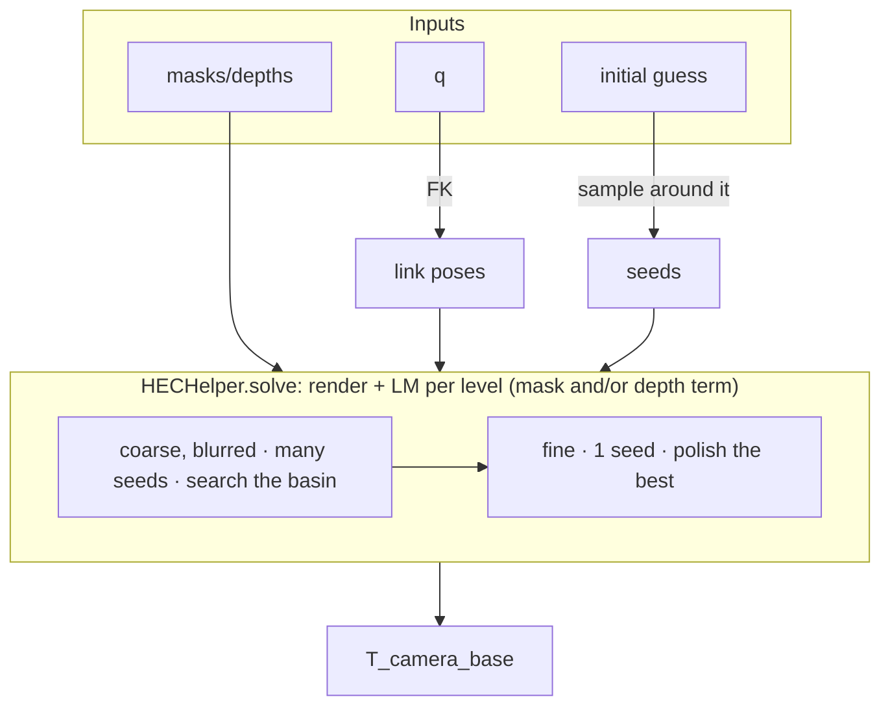

# Hand-Eye Calibration

`robokit.helpers.hec` solves the camera extrinsic (OpenCV `T_camera_base`) from robot
silhouette masks and/or depth maps. Given N images with known joint positions `q`, it
renders the robot with nvdiffrast and aligns the rendered masks to the targets with a
coarse-to-fine multi-seed Levenberg-Marquardt solver, no calibration board needed.

## Overview



## Quick start

From [examples/hec/01_sim_rgb.py](../../examples/hec/01_sim_rgb.py) (fixed camera, masks only):

```python
import warp as wp
from robokit.helpers.hec import HECHelper, presets
from robokit.robo import Robot

robot = Robot.load(urdf_path, load_meshes=True)

hec = HECHelper(presets.rgb, robot, camera_intrinsic=intrinsic, height=H, width=W)
predicted = hec.solve(initial, target_masks=masks, q=q)
```

`masks` are `[N, H, W]` float robot silhouettes, `q` is `[N, num_dofs]` in
`robot.spec.actuated_joint_names` order, `initial` is a rough `[4, 4]` guess
(up to ~35 cm / 45 deg off is fine with the default config).

## Common variants

**Mounted camera.** For a camera on a moving mount (e.g. wrist cam), pass per-sample
`T_mount_base`; the solve then happens in the mount frame and returns
`T_camera_mount`. See
[examples/hec/02_sim_mounted.py](../../examples/hec/02_sim_mounted.py):

```python
predicted = hec.solve(initial, target_masks=masks, q=q, T_mount_base=T_mount_base)
```

**Depth.** Each `PyramidLevel` has a `use_depth` flag. Enable it on the fine levels
for an RGB-D polish, or on every level for depth-only (masks omitted; pass robot-only
depth with 0 = invalid). See
[examples/hec/03_sim_depth.py](../../examples/hec/03_sim_depth.py):

```python
hec = HECHelper(presets.depth, robot, camera_intrinsic=intrinsic, height=H, width=W)
predicted = hec.solve(initial, target_depths=depths, q=q)
```

`presets.rgb` / `presets.rgbd` / `presets.depth` are prebuilt configs; for a custom
schedule set `use_depth` per `PyramidLevel`, and `depth_weight` on `HECHelperConfig`.

**Real hardware.** [examples/hec/04_real_xarm.py](../../examples/hec/04_real_xarm.py)
runs the full pipeline on an xArm + RealSense: capture images at a set of joint
configurations, segment the arm with SAM2, drag an initial guess in viser, then solve.
Larger initial errors need more seeds; it bumps `seed_noise_t/r` and per-level
`num_seeds` over the defaults.
