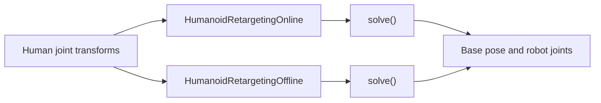

# Humanoid Retargeting

`robokit.helpers.humanoid_retarget` maps human motion to a floating-base robot. Online retargeting
advances one frame at a time; offline retargeting optimizes a whole trajectory. The snippets assume
`robot`, `device`, `motion`, and `human_heights` are loaded. Complete programs are in
[`examples/humanoid_retarget`](../../examples/humanoid_retarget/).

## How Retargeting Works

Both solvers map ordered human transforms to robot-link targets, then optimize the robot state.



Every pose is `(x, y, z, qw, qx, qy, qz)`, and joints must follow
`retargeter.human_joint_names`.

| Workflow | NumPy input | Output |
| --- | --- | --- |
| Online | `(B, J, 7)` | `(B, 7 + Q)` |
| Offline | `(B, T, J, 7)` | `(B, T, 7 + Q)` |

Here `B` is batch size, `T` is frame count, `J` is human joints, and `Q` is robot joints.
`human_heights` has shape `(B,)`; omitting it uses the preset's assumed height.

## Presets

Humanoid preset modules expose named configurations for each mapping and workflow.

```python
from robokit.helpers.humanoid_retarget.presets.g1_cali import g1_cali
from robokit.helpers.humanoid_retarget.presets.g1_offline import g1_offline
from robokit.helpers.humanoid_retarget.presets.g1_offline_mapping import g1_offline_mapping
```

## Online Retargeting

Online retargeting follows `__init__ → warmup → solve → reset`. Each solve advances one frame; the
caller owns the loop.

```python
retargeter = HumanoidRetargetingOnline(
    config=g1_cali,
    robot=robot,
    device=device,
)
retargeter.warmup(batch_size=1)
for T_world_human in motion:
    qpos = retargeter.solve_numpy(
        T_world_human=T_world_human[None],
        human_heights=human_heights,
    )[0]

retargeter.reset()
```

For online batches, call `warmup(batch_size=B)` and pass one `(B, J, 7)` frame on every iteration. Streams
advance in lockstep; repeat the last frame of shorter streams. Interaction retargeting is the one
exception: it supports `B = 1` only.

`reset(T_world_base=T_world_base)` clears the temporal state and seeds the floating base, which matters when the
first frame is far from the origin (see [`08_terrain.py`](../../examples/humanoid_retarget/08_terrain.py)).

See [`01_online.py`](../../examples/humanoid_retarget/01_online.py) and
[`06_online_batch.py`](../../examples/humanoid_retarget/06_online_batch.py).

## Collision and Interaction

The caller owns the `WarpScene`. Passing it enables configured robot-versus-scene terms;
self-collision is independent of the scene.

```python
retargeter = HumanoidRetargetingOnline(
    config=g1_cali,
    robot=robot,
    scene=scene,
    device=device,
)
```

Interaction retargeting preserves the relative arrangement of selected human joints and sampled
object or terrain points. Set the first target before `warmup`, then update it before each solve.

```python
from robokit.helpers.humanoid_retarget import build_interaction_mesh_frame

retargeter = HumanoidRetargetingOnline(
    config=g1_cali,
    robot=robot,
    scene=scene,
    device=device,
)
retargeter.interaction_task.set_frame(*build_interaction_mesh_frame(human_points[0], object_points, object_pose[0]))
retargeter.warmup(batch_size=1)

for i, T_world_human in enumerate(motion):
    retargeter.interaction_task.set_frame(*build_interaction_mesh_frame(human_points[i], object_points, object_pose[i]))
    qpos = retargeter.solve_numpy(T_world_human=T_world_human[None])[0]
```

`object_geom.update(...)` changes the scene; `set_frame(...)` changes the interaction target. The
first target fixes the vertex count.

See [`02_collision.py`](../../examples/humanoid_retarget/02_collision.py),
[`03_self_collision.py`](../../examples/humanoid_retarget/03_self_collision.py),
[`07_contact.py`](../../examples/humanoid_retarget/07_contact.py), and
[`08_terrain.py`](../../examples/humanoid_retarget/08_terrain.py).

## Offline and Batch Retargeting

Offline retargeting jointly optimizes all frames. `solve_numpy(...)` prepares its input shape
automatically; the Warp path requires `warmup(batch_size=B, num_frames=T)`. It takes the same mapping `config` as the
online solver plus an optimizer config, and **rejects** configs carrying online-only settings
(`interaction`, `correspondence_edges`, `scene_collision_weight`, `self_collision_weight`) rather
than ignoring them — use `HumanoidRetargetingOfflineConfig.self_collision_weight` instead.

```python
retargeter = HumanoidRetargetingOffline(
    config=g1_offline_mapping,
    offline_config=g1_offline,
    robot=robot,
    device=device,
)
qpos = retargeter.solve_numpy(
    T_world_human=motion[None],
    human_heights=human_heights,
)[0]
```

Both solvers accept `config=` and load the robot themselves when `robot` is omitted.

For unequal clip lengths, repeat the final frame to a common length and pass the real lengths.

```python
lengths = np.array([len(motion) for motion in motions], dtype=np.int32)
num_frames = int(lengths.max())
padded = np.stack(
    [np.concatenate([motion, np.repeat(motion[-1:], num_frames - len(motion), axis=0)]) for motion in motions]
)

qpos = retargeter.solve_numpy(
    T_world_human=padded,
    valid_lengths=lengths,
    human_heights=human_heights,
)
first_clip = qpos[0, : lengths[0]]
```

See [`04_offline.py`](../../examples/humanoid_retarget/04_offline.py) and
[`05_batch.py`](../../examples/humanoid_retarget/05_batch.py).
