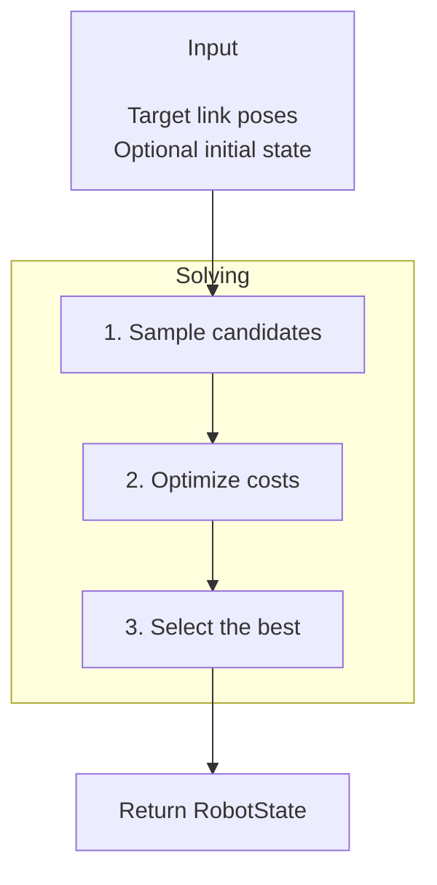

# IK

`robokit.helpers.ik` solves inverse kinematics with features including multiple target
links, floating bases, joint limits, smoothness, collision avoidance, and so on.

This tutorial covers the main IK workflows. The snippets assume `robot`, `device`, and
target data are already defined; complete runnable examples and visualizations are in
[`examples/ik`](../../examples/ik/).

## How IK Works

Each solve takes target link poses and an optional initial state, then follows three steps:

1. Sample candidate robot states near the initial state.
2. Run the configured optimizer (Levenberg-Marquardt by default) to reduce pose errors and
   other costs.
3. Keep the best candidates and return them as a `RobotState`.



## Basic IK

An `IK` combines a configuration, a robot, and the link to move. `presets.basic` includes
position, rotation, and joint-limit terms.

Pass the target as a translation-first 7D pose:

```python
from robokit.helpers.ik import IK, presets

ik = IK(presets.basic, robot=robot, link="panda_hand", device=device)

T_world_target = [0.5, 0.2, 0.5, 0.0, 0.0, 1.0, 0.0]  # x, y, z, qw, qx, qy, qz
state = ik.solve_numpy(T_world_target)
q = state.q.numpy()[0]
```

The first solve builds the solver for its batch size. Call `ik.warmup(batch_size=1)` before
the first solve when that setup cost must happen outside a control loop. Create a new `IK`
to change the batch size.

`solve()` is the Warp-native interface.

### Repeated IK

`presets.smooth` adds a smoothness term. Pass the previous result as both `init_state` and
`prev_state` when solving a moving target:

```python
ik = IK(presets.smooth, robot=robot, link="panda_hand", device=device)

state = None
for T_world_target in target_trajectory:
    state = ik.solve_numpy(T_world_target, init_state=state, prev_state=state)
```

`init_state` centers the new samples near the previous answer. `prev_state` supplies the
reference for temporal terms and lets the solver keep the previous answer when it scores
better than the new one.

### Custom Terms

Build an `IKConfig` when a preset does not contain the terms you need:

```python
from robokit.helpers.ik import IK, IKConfig
from robokit.terms.dense.position_limit import PositionLimit
from robokit.terms.dense.position_task import PositionTask
from robokit.terms.dense.rotation_task import RotationTask
from robokit.terms.dense.smoothness_task import SmoothnessTask

config = (
    IKConfig(init_sample_range=1.0)
    .add(PositionTask(weight=20.0))
    .add(RotationTask(weight=10.0))
    .add(PositionLimit(weight=50.0))
    .add(SmoothnessTask(weight=1.0))
)
ik = IK(config, robot=robot, link="panda_hand", device=device)
```

Position and rotation tasks use the target passed to `solve`. Other terms add constraints
or preferences. Use `add_score()` instead of `add()` when a term should only rank the final
candidates, not guide optimization.

## Batch IK

Batch IK solves several targets in one call. Add a leading batch dimension to the target
array:

```python
T_world_target_batch = ...  # Shape: (batch, 7)

ik = IK(presets.smooth, robot=robot, link="panda_hand", device=device)
state = ik.solve_numpy(T_world_target_batch)
q_batch = state.q.numpy()
```

The output shape is `(batch * ik.num_solutions, dofs)`. All presets return one solution per
target. A custom final stage may retain more; those solutions use instance-major order.

## Multiple Target Links

Pass multiple link names to solve for several links together. Each target row matches the
link at the same position in `links`:

```python
links = ["yumi_link_7_r", "yumi_link_7_l"]
ik = IK(presets.single_seed, robot=robot, link=links, device=device)

T_world_target = ...  # Shape: (2, 7), or (batch, 2, 7)
state = ik.solve_numpy(T_world_target)
```

To give the links different importance, pass per-link weights to `PositionTask` or
`RotationTask`, such as `PositionTask(weight=[20.0, 5.0])`.

## Floating Base

Set `enable_T_world_base=True` to optimize six base DOFs along with the joints. A value of
zero in `base_lock_mask` locks that DOF; the following configuration allows planar base
motion and locks z, roll, and pitch:

```python
config = (
    IKConfig(
        enable_T_world_base=True,
        init_sample_range=1.0,
        base_init_sample_range=1.0,
        base_lock_mask=[1.0, 1.0, 0.0, 0.0, 0.0, 1.0],
    )
    .add(PositionTask(weight=10.0))
    .add(RotationTask(weight=5.0))
    .add(PositionLimit(weight=50.0))
    .add(SmoothnessTask(weight=0.1, base_weight=0.5))
)
ik = IK(config, robot=robot, link="gripper_link", device=device)

state = ik.solve_numpy(T_world_target, init_state=state, prev_state=state)
T_world_base = state.T_world_base.numpy()[0]
```

`base_sample_translation_mask` controls which translation axes are sampled around the
initial base pose. Its default `(1.0, 1.0, 0.0)` samples x and y but not z.

## Collision Avoidance

Load the robot with collision spheres, then add scene and self-collision terms:

```python
from robokit.terms.dense.scene_collision_task import SceneCollisionTask
from robokit.terms.dense.self_collision_task import SelfCollisionTask

config = (
    IKConfig(init_sample_range=1.0, solver=presets.smooth.solver)
    .add(PositionTask(weight=20.0))
    .add(RotationTask(weight=10.0))
    .add(PositionLimit(weight=50.0))
    .add(SmoothnessTask(weight=1.0))
    .add(SceneCollisionTask(robot, scene=scene, weight=100.0, margin=0.02))
    .add(SelfCollisionTask(robot, representation="sphere", weight=5.0, margin=0.01))
)
ik = IK(config, robot=robot, link="panda_hand", device=device)
```

The margin keeps collision spheres away from obstacles or one another. The scene layout is
fixed after the solver is built. Update existing geometry poses in place; create a new `IK`
only when the layout changes.

## Runtime Changes

Every term receives a name such as `position_task_0`. For terms that support runtime weight
updates, use that name to change the weight without rebuilding the solver:

```python
ik.set_weight("position_task_0", 20.0 * proximity_factor(state))
ik.set_weight("rotation_task_0", [0.0, 1.5])  # one weight per target link
```

`set_active_joint_mask()` and `set_active_base_mask()` can also lock DOFs at runtime. Other
structural changes, including links, terms, solver stages, collision margins, and scene
layout, require a new `IK`.
