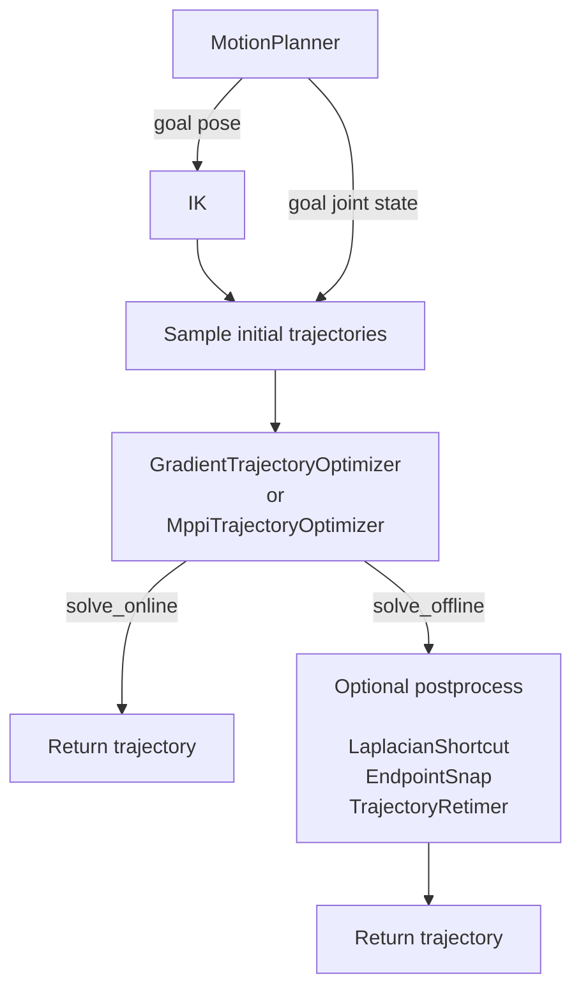

# Motion Planning

`robokit.helpers.motion_plan` plans a collision-free joint trajectory from a start state to
a goal pose or joint state. Basic planning solves one motion, batch planning solves several
motions together, and online planning repeatedly updates a trajectory while the robot moves.

This tutorial explains each workflow before showing the planner calls that implement it. The
snippets assume `robot`, `scene`, `device`, and `start_q` are already defined; complete runnable
setups and visualizations are in [`examples/motion_plan`](../../examples/motion_plan/).

## How Planning Works

`MotionPlanner` follows one pipeline:

1. For a pose goal, `IK` finds goal joint states. A joint-state goal skips IK.
2. The planner samples initial trajectories from the start state to those goals.
3. `GradientTrajectoryOptimizer` or `MppiTrajectoryOptimizer` refines the trajectories for
   the goal, collisions, joint limits, and smoothness.
4. `solve_online()` returns the trajectory directly. `solve_offline()` may apply configured
   postprocessing first.



## Basic Planning

A `MotionPlanner` combines a robot, its end-effector link, a collision scene, and a planning
configuration. The configuration chooses the trajectory optimizer and offline processing.
`presets.offline` uses LM, while `presets.offline_lbfgs` uses L-BFGS with the same API.

For a pose goal, pass its translation-first 7D pose. The planner first solves goal IK,
samples initial trajectories, optimizes them, and runs the configured offline processing.

```python
from robokit.helpers.motion_plan import MotionPlanner, presets

T_world_target = np.array(
    [0.60, 0.0, 0.40, 0.0, 1.0, 0.0, 0.0],  # x, y, z, qw, qx, qy, qz
    dtype=np.float32,
)
planner = MotionPlanner(presets.offline, robot, "panda_hand", scene=scene, device=device)
result = planner.solve_offline_numpy(start_q, T_world_target=T_world_target)

q_traj = result.q_traj[0]
motion_time = result.motion_time[0]
```

Pose and joint-state goals use different configurations because a joint-state goal skips
goal IK and pins the last trajectory waypoint directly. The result contains the optimized
joint trajectory and its uniformly retimed execution duration.

```python
planner = MotionPlanner(presets.q_goal, robot, "panda_hand", scene=scene, device=device)
result = planner.solve_offline_numpy(start_q, target_q=target_q)
```

The scene layout and batch size become fixed when the planner first allocates its buffers.
Move existing obstacles with `geom.update(...)`; rebuild the planner only when the scene
layout or batch size changes.

### Optional Postprocessing

Offline planning can process the optimized trajectory before returning it:

- `LaplacianShortcut` applies Laplacian smoothing by pulling waypoints toward the midpoint of
  nearby waypoints and rejects changes that worsen collisions.
- `EndpointSnap` snaps the final configuration toward the goal pose and blends the adjustment
  into the previous waypoints.
- `TrajectoryRetimer` recomputes the shared timestep for all segments from the velocity,
  acceleration, and jerk limits, then multiplies it by the number of segments to obtain the
  motion time. It does not modify the waypoints.

## Batch Planning

Batch planning solves several start-goal pairs in one call. Starts and goals gain a leading
batch dimension, while `scene_indices[i]` selects the collision scene used by query `i`.
The number of queries and the number of scenes are independent.

For example, the following batch contains four planning queries routed to two scenes:

```text
query:          0  1  2  3
scene_indices:  0  0  1  1
```

The planning call itself does not change:

```python
start_q_batch = ...  # Shape: (4, dofs)
T_world_target_batch = ...  # Shape: (4, 7)
scene_indices = np.array([0, 0, 1, 1], dtype=np.int32)

# Here scene is a WarpScene containing scene 0 and scene 1.
planner = MotionPlanner(presets.offline, robot, "panda_hand", scene=scene, device=device)
result = planner.solve_offline_numpy(
    start_q=start_q_batch,
    T_world_target=T_world_target_batch,
    scene_indices=scene_indices,
)

q_traj_batch = result.q_traj
```

For a shared scene, use a one-scene `WarpScene` and fill `scene_indices` with zeros. A scene
may combine boxes, meshes, and other geometry types; the per-query mapping remains the same.

## Online Planning

Online planning runs in a control loop. Each iteration plans from the current robot state,
executes the next trajectory waypoint, and uses that new state for the next iteration.
Goals and obstacle poses may be updated before every solve.

MPPI retains its trajectory and action distribution between updates. The caller solves goal IK
when the pose target changes and passes that joint goal into each planning update.

```python
planner = MotionPlanner(presets.online_mppi, robot, "panda_hand", scene=scene, device=device)

current_q_wp = wp.array(start_q[None], dtype=wp.float32, device=device)
T_world_target_wp = wp.array(
    [[0.60, 0.0, 0.40, 0.0, 1.0, 0.0, 0.0]],
    dtype=wp_vec7,
    device=device,
)
target_q_wp = planner.solve_goal_ik(T_world_target_wp, rest_q=current_q_wp)

online_state = None
for _ in range(20):
    result = planner.solve_online(
        current_q_wp,
        T_world_target_wp,
        target_q=target_q_wp,
        online_state=online_state,
    )
    online_state = result.online_state
    current_q = result.q_traj.numpy()[0, 1].copy()
    current_q_wp.assign(current_q[None])
```

For L-BFGS, use `presets.online_lbfgs`. It can solve pose IK internally, so `target_q` may be
omitted.

For moving environments, update geometry with `geom.update(...)` before the next solve. Tight
control loops should preallocate their input Warp arrays instead of allocating them inside the loop.
